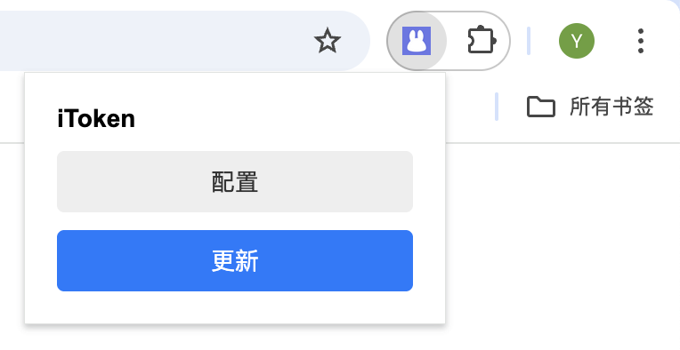
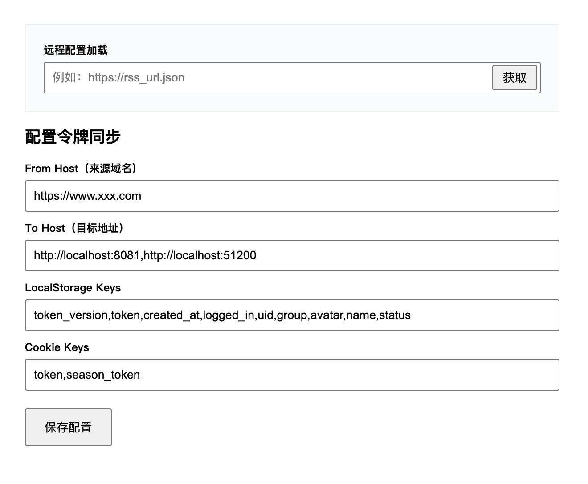

# iToken - Token & Cookie Sync for Chrome Dev

**iToken** is a Chrome extension designed to streamline web development by automatically extracting `token`, `cookie`, and `localStorage` data from live environments and injecting them into your local development environment tabs.

> ⚠️ This extension does **not** currently modify CORS headers due to Chrome Manifest V3 limitations on preflight (`OPTIONS`) requests.

## ✨ Features

- 🔑 Extract `localStorage` and `cookie` values from any online page
- 🔁 Inject token-related data into one or more local `localhost` or custom domain tabs
- ⚙️ Fully configurable: target domains, keys to sync, etc.
- 🧪 Ideal for testing authenticated APIs in local dev environments

## 🧩 How It Works

1. Configure:
   - The **source domain** (where you’re logged in)
   - One or more **target domains** (e.g., `http://localhost:3000`)
   - Keys to extract (e.g., `token`, `session_token`)
2. Click the extension to sync your data
3. Data is automatically injected into all target tabs

## 🛠️ Installation

1. Clone or download this repo
2. Go to `chrome://extensions`
3. Enable "Developer mode"
4. Click "Load unpacked" and select the extension folder
5. Done!

## 📷 Screenshots

**Extension Popup:**

**Options Page:**

## 🚫 Known Limitations

- Cannot modify preflight CORS responses (`OPTIONS` requests)
- Fails silently if the target tab is an error/404 page (e.g., local server not running)

## 💡 Roadmap

- [ ] Optional CORS support via external proxy
- [ ] Support for sessionStorage
- [ ] One-click re-injection on page reload

## 📄 License

MIT License

---

Built with ❤️ by iRuxu